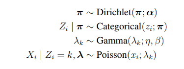

The Poisson Mixture Model for which I implemented the EM algorithm using both MAP and MLE estimates for the unknown parameters, in addition to an implementation of a Gibbs sampler to estimate the parameters.
Notebooks are appropriately named and include diagnostic plots alongside their final reported estimates.  